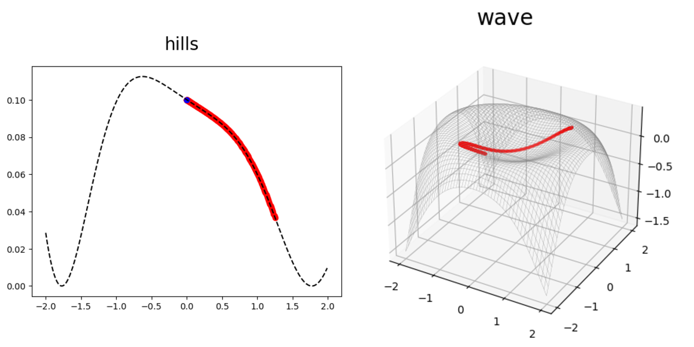
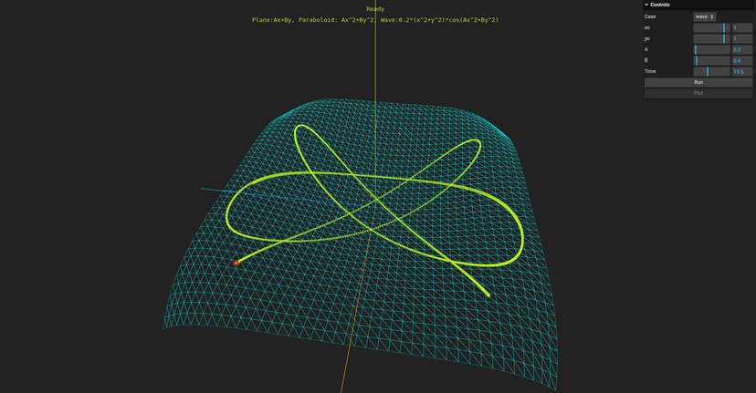

# Codes to carry out the simulations of motions over a surface using autugrad and Lagrange multipliers.

As discusssed in detail in the [blog entry](https://calugo.github.io/posts/constraints-in-mechanics-and-automatic-differentiation./) the codes here use autograd to compute the Lagrange multipliers required to constrain the motion of a particle over a surface under the action of gravity.

The codes contained in `docs` contain the project files to run the simulations using `threejs` and `Pyodide` on the Browser as shown [here](https://calugo.github.io/Lagrange-Multipliers-with-autodiff/). These are four files:

* index.html - Document.
* 3dscript.js - Rendering and interactive calls to integrate the equations.
* integrals.py - Numerical methods written in python
* main.css - style.

All the necessary modules are called using cdn sources. Just be sure to serve locally the files to run it.

I also provide a small script to run the numerical methods and plot the results. These are the files LagrangeMultipliers_lib.py  and LMRK.py

LagrangeMultipliers_lib.py - Contains the function definitions for three surfaces called: `wave`, `plane`, `paraboloid` and three plane curves called: `hills`, `slope` and `parabola` defined as:

* slope: $ax+b$
* parabola: $ax^2+b$
* hills: $0.1e^{-x/a} \cos(bx^2)$
* plane: $ax+by$
* paraboloid: $ax^2+by^2$
* wave: $0.2(x^2+y^2)\cos(ax^2+by^2)$

Obviously, any other numpy function can be used. These are just demos. The script LMRK.py solves the problem for every example using a set of parameters values, initial conditions and integration times defined for each case in the code.

The project uses `autograd` so it should be installed in your system. 

Excecuting `./LMRK.py`, shoud generate plots which will look like the ones showed below:

## Webassembly - Panel version.

A live web-version running the code can be found if you click on the image below.

The code is the same as the one provided here. 

Please do not forget to visit the details describe in the [site](https://calugo.github.io/posts/constraints-in-mechanics-and-automatic-differentiation./)

As well as the documentation of [Autograd](https://github.com/HIPS/autograd) and [Pyodide](https://pyodide.org/en/stable/)
